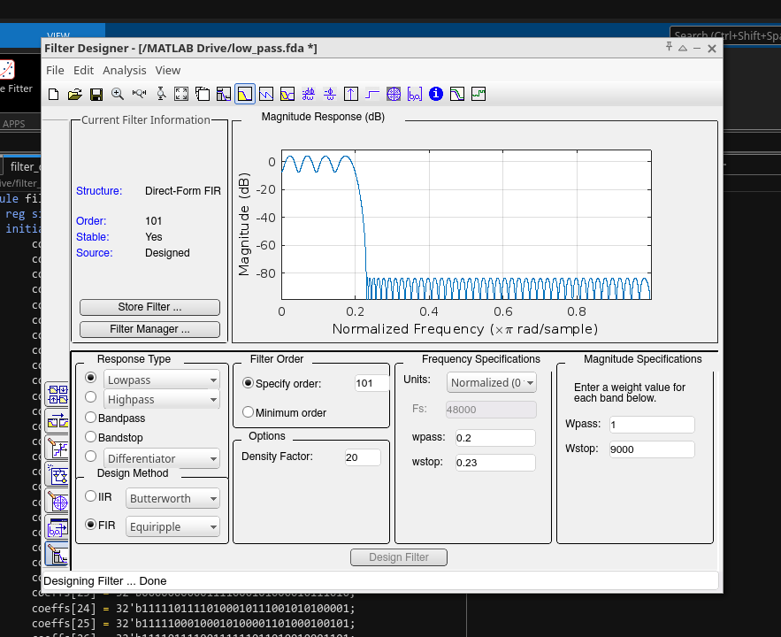
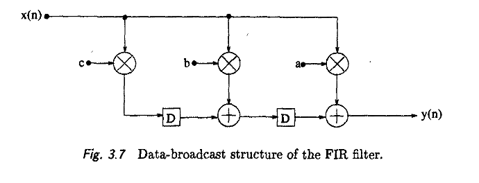
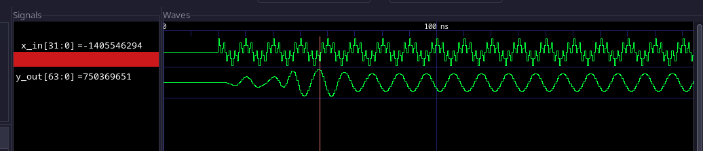
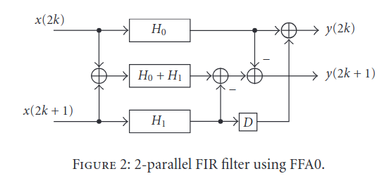
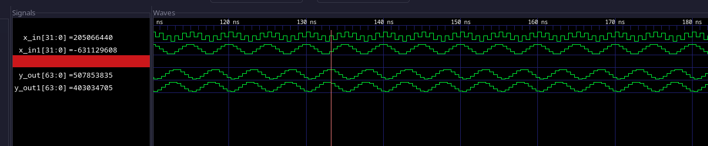
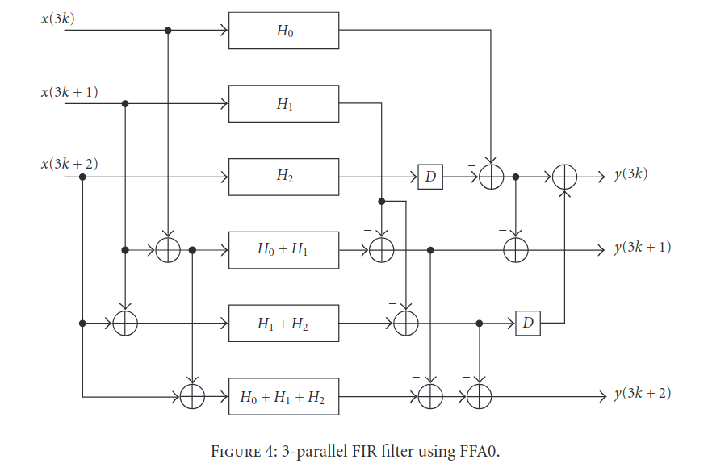
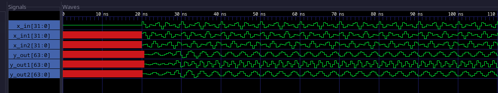
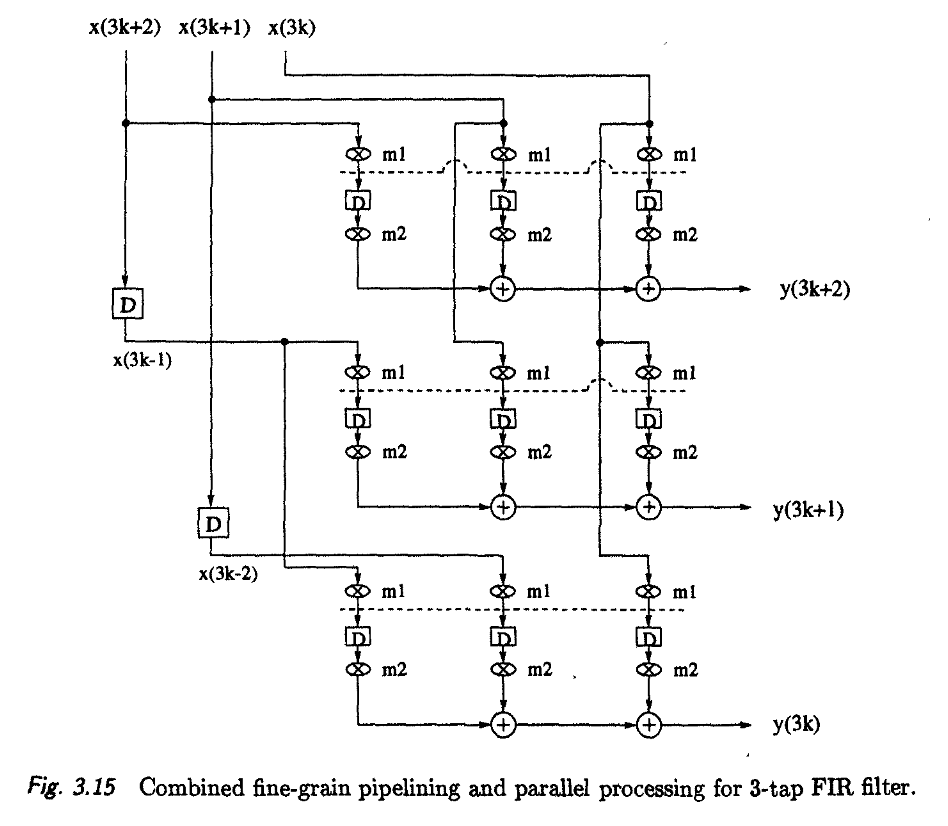
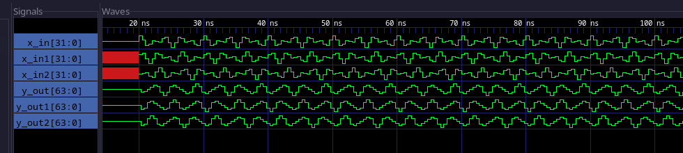

# Advanced VLSI - Project 1

## Project Prompt:
The objective of this course project is to design and implement low-pass FIR filter. Using Matlab to construct a 100-
tap low-pass filter with the transition region of 0.2pi~0.23pi rad/sample and stopband attenuation of at least 80dB
(you may increase the number of filter taps if necessary).

For the FIR filter architecture, consider (i)
pipelining, (2) reduced-complexity parallel processing (L=2 and L=3), and (3) combined pipelining and L=3 parallel
processing.

## Process:
1. First, Matlab Filter Designer was used to generate 102 coefficients for a 102 tap filter (102 taps is chosen since it is divisible by 2 and 3, which will make parallelizing simpler). 



As seen in the image above, the filter's transistion region is between .2 pi and .23 pi, and the stop band attenuation is greater than 80 dB.

The filter coefficients were quantized to 32 bit signed integers and scaled to ensure that the span of coefficients occupied the entire range representable by 32 bits. This quantization approach led to little to no degradation in the response of the filter. (No plot shown since the difference was so minor). To account for the scaling that was done to minimize the quantization effect in the coefficients, the final outputs in every filter design shown below are right-shifted by 31 bits to return the final answer to the original range.

2. Next, a python script (`./Python/coef-h-to-signed-int.py`) was used to save these coefficients as 32 bit binary signed integers for use in verilog. The script also added assignment statements for ease of use in hdl files. These 32 bit binary signed integer coefficients can be found in (`./Python/coefficients.txt`). The base 10 version of these coefficients are hard coded into the python conversion script.

```python
coefficients = [
    -515860,    -2018687,    -5362055,   -11603411,   -21565046,   -35686216,
     -53391945,   -73016489,   -91589053,  -105383425,  -110503938,  -104071341,
     -85106985,   -55386511,   -19394114,    16263560,    44412288,    59059851,
      57255182,    40094432,    12808605,   -16548769,   -39239822,   -48499961,
     -41634426,   -21072786,     6284126,    31124103,    44802172,    42279435,
      24077016,    -3663544,   -31021587,   -47672121,   -46588404,   -26900426,
       5290124,    38504411,    59634059,    58627446,    32633810,   -11961939,
     -60449778,   -93673757,   -93794353,   -50239678,    36110148,   151932119,
     274204040,   376007135,   433764903,   433764903,   376007135,   274204040,
     151932119,    36110148,   -50239678,   -93794353,   -93673757,   -60449778,
     -11961939,    32633810,    58627446,    59634059,    38504411,     5290124,
     -26900426,   -46588404,   -47672121,   -31021587,    -3663544,    24077016,
      42279435,    44802172,    31124103,     6284126,   -21072786,   -41634426,
     -48499961,   -39239822,   -16548769,    12808605,    40094432,    57255182,
      59059851,    44412288,    16263560,   -19394114,   -55386511,   -85106985,
    -104071341,  -110503938,  -105383425,   -91589053,   -73016489,   -53391945,
     -35686216,   -21565046,   -11603411,    -5362055,    -2018687,     -515860
]
```

3. Next, several python scripts were utilized to generate discretized input signal data for use in filter test benches. These scripts can all be found within the `./Python/` directory. One very important step in generating this signals was to ensure that the signal samples were stored in a big endian format. This is because the test benches used to interact with each filter utilized the `$fread` function which expects big endian data. This nuance took me a very long time to figure out as my python scripts were storing data in little endian format by default. 

Among the several signals generated, notably, a two-tone sinusoid (components at 100MHz and 500MHz) was generated. This signal nicely demonstrates the filtering capabilities of the filters implemented in this project. The 100MHz component of this signal should be firmly in the pass band, and the 500MHz signal should be firmly in the stop band. When generating these discretized input signals, a sample rate of 2GHz was used. The operating speed of all filters in this project will be held at 2GHz. This operating frequency was chosen in the hopes that the filters could perform real-time signal processing on the two-tone signal test account for some room for error. 

4. Now that the filter coefficients and test signals have been generated, we can begin implementing and benchmarking various filter architectures. Each filter is implemented using System Verilog, simulated with iverilog and examined using GTKWave. Once determined to be working via behavioral simulation, Cadence Genus is used to synthesize each filter and generate timing, area, and power reports for benchmarking purposes. The synthesis tool (Genus) is configured to use standard cells from a typical 45nm process.

## Results and Analysis
### Pipelined Only Low Pass FIR Filter:

This 102 tap FIR filter was implemented in direct form with added pipeline registers following each adder. Each cycle, the input sample is multiplied by every single coefficient, and the partial sum of all prior samples with prior coefficients is stored in a register.



The critical path of this pipelined filter is one multiplier and one adder.

To verify the behavior of the filter, a test bench inputs a two tone sine wave (100MHz + 500MHz tones) and the resulting filtered output is plotted.



#### Area Report 
When synthesized using Cadence Genus and 45nm standard cells, the area of this design is ~.39mm^2 or about 625 microns by 625 microns if square. Further information can be found in `./PipelinedFilter/Cadence_Genus/PipelineFilter_Area.rpt`

It's worth noting that Genus performs extensive optimization via various techniques including buffer insertion which can add cells and therefore area to the design. Genus settings were kept consistent throughout benchmarking to ensure fair comparison across designs.

#### Power Report
```
Instance: /filter
Power Unit: W
PDB Frames: /stim#0/frame#0
  -------------------------------------------------------------------------
    Category         Leakage     Internal    Switching        Total    Row%
  -------------------------------------------------------------------------
      memory     0.00000e+00  0.00000e+00  0.00000e+00  0.00000e+00   0.00%
    register     3.95634e-03  1.18613e+00  8.95537e-02  1.27964e+00  25.67%
       latch     0.00000e+00  0.00000e+00  0.00000e+00  0.00000e+00   0.00%
       logic     3.02380e-02  2.37488e+00  1.29936e+00  3.70448e+00  74.33%
        bbox     0.00000e+00  0.00000e+00  0.00000e+00  0.00000e+00   0.00%
       clock     0.00000e+00  0.00000e+00  0.00000e+00  0.00000e+00   0.00%
         pad     0.00000e+00  0.00000e+00  0.00000e+00  0.00000e+00   0.00%
          pm     0.00000e+00  0.00000e+00  0.00000e+00  0.00000e+00   0.00%
  -------------------------------------------------------------------------
    Subtotal     3.41944e-02  3.56101e+00  1.38891e+00  4.98411e+00 100.00%
  Percentage           0.69%       71.45%       27.87%      100.00% 100.00%
  -------------------------------------------------------------------------
```
The entire design consumes 5 watts, with 75% of this consumption coming from logic.

#### Timing Report
The design is a bit to slow to keep up with the 2GHz operating frequency chosen at the beginning of the project. The timing report shows -552 ps of slack in the circuit.

The path that doesn't meet timing requirements is from the input through several buffers, to several multipliers, adders, and eventually to the stage register where the partial sum is stored. All of these extra cells are inserted by genus to make the design synthesizable and genus goes through many iterations to optimize how it uses standard cells to achieve an implementation. Regardless, the clock speed would need to be lowered in order to effectively utilize this design.


### 2-Parallel Low Pass FIR Filter:

This 102 tap filter was implemented using the 2-parallel + FFA0 architecture from [[2]](https://www.researchgate.net/publication/26532566_Frequency_Spectrum_Based_Low-Area_Low-Power_Parallel_FIR_Filter_Design).



The critical path for this architecture is (102/3) multipliers and adders (found in each of the three MAC lines).

Once again, to verify the behavior of the filter, the two tone sinusoid was processed by the filter and the resulting output can be seen below.



As seen above, the filter rejects the high frequency component (mostly captured by x_in), and passes the lower frequency component (seen in x_in1).

#### Area Report
This design is much larger than the pipelined version of the filter. The total area is ~1.08 mm^2. More information can be found in `./ParallelFilter_L=2/Cadence_Genus/2ParallelFilter_Area.rpt`

#### Power Report
```
Instance: /filter
Power Unit: W
PDB Frames: /stim#0/frame#0
  -------------------------------------------------------------------------
    Category         Leakage     Internal    Switching        Total    Row%
  -------------------------------------------------------------------------
      memory     0.00000e+00  0.00000e+00  0.00000e+00  0.00000e+00   0.00%
    register     2.42200e-03  4.52471e-01  2.17971e-02  4.76690e-01   3.60%
       latch     0.00000e+00  0.00000e+00  0.00000e+00  0.00000e+00   0.00%
       logic     1.04939e-01  7.84042e+00  4.81742e+00  1.27628e+01  96.40%
        bbox     0.00000e+00  0.00000e+00  0.00000e+00  0.00000e+00   0.00%
       clock     0.00000e+00  0.00000e+00  0.00000e+00  0.00000e+00   0.00%
         pad     0.00000e+00  0.00000e+00  0.00000e+00  0.00000e+00   0.00%
          pm     0.00000e+00  0.00000e+00  0.00000e+00  0.00000e+00   0.00%
  -------------------------------------------------------------------------
    Subtotal     1.07361e-01  8.29289e+00  4.83922e+00  1.32395e+01 100.00%
  Percentage           0.81%       62.64%       36.55%      100.00% 100.00%
  -------------------------------------------------------------------------
```
Unsurprisingly, the design also consumes more power at ~13 Watts. Nearly all of this power consumption comes from logic at over 96% of consumption.


#### Timing Report
The timing report once again shows negative slack. This design us about 1ns too slow on the critical path as compared to 550ps with the pipelined design. This time, the critical path is from the even_samples register all the way to the y_out1 output. It is very important to note that the slack and power consumption are in reality about on par with the pipelined design since adding parallelism enables us to decrease the clock speed without affecting the throughput of the circuit. Since this design has 2x parallelism, we could safely halve the operating frequency and achieve the same performance as the pipelined design. All of this is only true of course if the signal you are sampling has a nyquist frequency that is less than or equal to the newly halved clock frequency - if your goal is to support real-time filtering. The circuit instead store samples in a buffer and process them at any rate that suits the filter implementation.

### 3 Parallel Low Pass FIR Filter
The 3-Parallel implementation of this low pass filter was realized using the 3-Parallel using FFA0 design in [[2]](https://www.researchgate.net/publication/26532566_Frequency_Spectrum_Based_Low-Area_Low-Power_Parallel_FIR_Filter_Design)



The image below shows the 3-parallel filter's behavior when processing our two tone sinusoid:




#### Area Report
The area report from Cadence Genus shows that the 3-Parallel filter implementation occupies .906 mm^2. This is slightly smaller than the 2-parallel implementation. I believe this is partially due to the fact that Genus sees the filter as being so far out of spec that it spends more time searching for a more optimal implementation. The synthesis process took close to three hours for this design.

#### Power Report
```
Instance: /filter
Power Unit: W
PDB Frames: /stim#0/frame#0
  -------------------------------------------------------------------------
    Category         Leakage     Internal    Switching        Total    Row%
  -------------------------------------------------------------------------
      memory     0.00000e+00  0.00000e+00  0.00000e+00  0.00000e+00   0.00%
    register     2.39722e-03  4.47747e-01  2.04399e-02  4.70584e-01   6.37%
       latch     0.00000e+00  0.00000e+00  0.00000e+00  0.00000e+00   0.00%
       logic     7.40536e-02  4.35375e+00  2.48493e+00  6.91273e+00  93.63%
        bbox     0.00000e+00  0.00000e+00  0.00000e+00  0.00000e+00   0.00%
       clock     0.00000e+00  0.00000e+00  0.00000e+00  0.00000e+00   0.00%
         pad     0.00000e+00  0.00000e+00  0.00000e+00  0.00000e+00   0.00%
          pm     0.00000e+00  0.00000e+00  0.00000e+00  0.00000e+00   0.00%
  -------------------------------------------------------------------------
    Subtotal     7.64508e-02  4.80149e+00  2.50537e+00  7.38331e+00 100.00%
  Percentage           1.04%       65.03%       33.93%      100.00% 100.00%
  -------------------------------------------------------------------------
```
The design consumes about 7.4 watts of power, again mostly from the logic cells. This again could be due to Genus finding a more optimal implementation than in previous designs.


#### Timing Report
The timing report shows that the critical path has a slack of -1745ps. The critical path starts at the sample register and goes all the way to the output. More detailed info can be found in `./ParallelFilter_L=3/Cadence_Genus/3ParallelFilter_Timing.rpt`. The same logic applies to this design as the 2-parallel design. The larger amount of slack isn't indicative of the throughput of the filter. Since the timing constraints held the operating frequency at 2GHz with the hope that the filter would remain fast enough to perform real-time processing, the slack looks the worst in this example. Had the clock rate been divided by three, the circuit would have had an easier time keeping up with timing requirements. 

### 3 Parallel and Pipelined Low Pass FIR Filter
In order to utilize the benefits of both parallelism and pipelining, I implemented the architecture found on page 73 of the course textbook [1].



In this implementation, pipeline registers are added between the multipliers of each branch of the filter. This decreases the critical path to the adders that accumulate the results from the multipliers.

The filter behaves as expected when given the two tone sinusoid as input (see below).



The filter rejects higher frequency components (distributed across the three input branches), and passes lower frequency components.

#### Area Report
Shockingly, the area occupied by the 3-parallel pipelined design is only 16,000 square microns or ~0.016mm^2. I believe that this shocking result is due to Genus attempting to optimize the circuit's critical path to meeting timing constraints. In the pipelined only design, the area was small and the slack was close to being in spec. In the 2 and 3 parallel designs, the critical path was much larger and therefore the negative slack was far worse. As a result, Genus spent more time incrementally optimizing and adding more circuitry to try to meet timing requirements. In this design, the critical path is much shorter thanks to the pipelining, and Genus doesn't have to do as much optimization to get close to spec. Further evidence of this is the fact that Genus took about three hours to synthesize the 3-parallel design, but it only took minutes to synthesize this design (despite keeping all Genus settings constant).

#### Power Report
```
Instance: /filter
Power Unit: W
PDB Frames: /stim#0/frame#0
  -------------------------------------------------------------------------
    Category         Leakage     Internal    Switching        Total    Row%
  -------------------------------------------------------------------------
      memory     0.00000e+00  0.00000e+00  0.00000e+00  0.00000e+00   0.00%
    register     2.04245e-04  5.25158e-02  6.19283e-03  5.89129e-02  31.11%
       latch     0.00000e+00  0.00000e+00  0.00000e+00  0.00000e+00   0.00%
       logic     1.19694e-03  8.19056e-02  4.36546e-02  1.26757e-01  66.94%
        bbox     0.00000e+00  0.00000e+00  0.00000e+00  0.00000e+00   0.00%
       clock     0.00000e+00  0.00000e+00  3.68400e-03  3.68400e-03   1.95%
         pad     0.00000e+00  0.00000e+00  0.00000e+00  0.00000e+00   0.00%
          pm     0.00000e+00  0.00000e+00  0.00000e+00  0.00000e+00   0.00%
  -------------------------------------------------------------------------
    Subtotal     1.40119e-03  1.34421e-01  5.35315e-02  1.89354e-01 100.00%
  Percentage           0.74%       70.99%       28.27%      100.00% 100.00%
  -------------------------------------------------------------------------
```

As a result of adding less standard cells for the sake of meeting timing requirements, the power consumption of this design is far better. The entire filter only consumes about 200mW with more of the consumption coming from registers at ~30%.

#### Timing Report
Finally, the timing report shows that this design is much closer to meeting specs than all the others. The critical path (which is far shorter than the critical path in the other designs) has a negative slack of about 350ps. The critical path starts at the accumulation pipeline register, goes through the adder tree, and ends at the output. This design is so much faster than other architectures because the pipeline registers restrict the critical path to the adder tree used in the accumulation. On top of this, since the design is 3-parallel, each adder tree is 1/3rd the length of the adder tree in the pipelined only implementation. The full timing report can be found at `./PipelinedParallelFilter_L=3/Cadence_Genus/3ParallelPipelinedFilter_timing.rpt`


### Final Conclusions
Both theory and synthesis results show us that the most practical design is the parallelized and pipelined design. While the schematic for the 3-parallel fine-grain pipelined filter might be slightly more difficult to understand and therefore harder to capture, the benefits clearly outweigh this design complexity cost. 

The 3-parallel pipelined filter was not only faster, it was smaller, and consumed less power.

In the future however, it would be prudent to choose a more reasonable operating frequency for each design, and to cross compare the achieved throughput with area and power consumption required. I believe that Genus's optimization routine significantly impacted the final implemenation of several of these designs making the comparisons somewhat unfair. In the original design of these experiments, I had figured that keeping the operating frequency and timing constraints identical across implementations would be the most scientific approach to ensuring apples-to-apples comparison, however seeing the huge changes made by the synthesis tool in an attempt to meet unrealistic specs, it is safe to say that the experiment should be redesigned.


